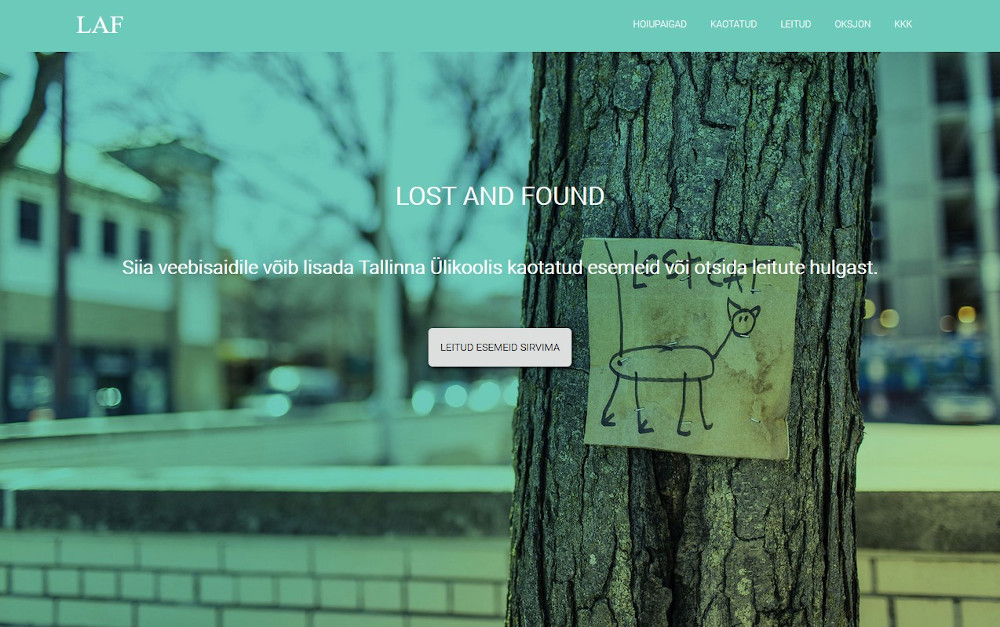
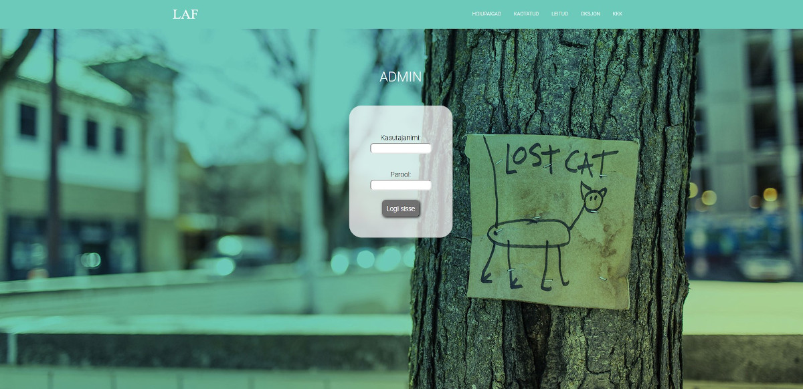

# TLÜ LAF

## Eesmärk ja lühikirjeldus
LAF-i veebilehe abil on võimalik Tallinna Ülikooli tudengitel lihtsamini leida enda kaduma läinud esemeid. Juhul kui eseme omanikku ei selgu, siis liigub leitud ese oksjoni rubriiki. Oksjonil on võimalik soovijal teha oma pakkumine ning ese ära osta.

Lehest on suur abi ka ülikoolile kuna varasemalt jäi palju asju kappidesse seisma. Töötajate elu lihtsustamiseks on lisatud mitmeid automaatseid tegevusi:
- kuulutuste kustumine teatud aja möödudes
- leitud eseme kuulutuse oksjoni rubriiki liikumine
- e-maili teavitused eseme leidmise/oksjoni võidu puhul

LAF-i veebileht on valminud [Tallinna Ülikooli Digitehnoloogiate instituudis](https://www.tlu.ee/dt) tarkvaraarenduse projekti aine raames.

## Ekraanipildid (tava ning admini lehest)





## Kasutatud tehnoloogiad


## Projekti liikmed
Anneli Põldaru, Sandra Maidla, Anete Vaalu, Liina Tobro, Herman Petrov

## Paigaldusjuhised

...täiendamisel

## Litsents

```
...täiendamisel
```